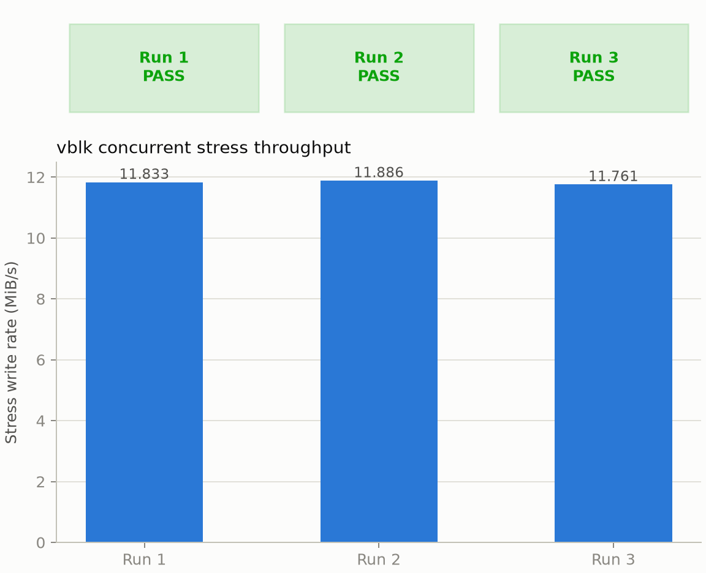

# vblk — Linux Block Device Driver

[](../LICENSE)
[](vblk.c)
[](vblk.c)
[](docker/Dockerfile)
[](docker/run.sh)

A Linux kernel module implementing a virtual, RAM-backed block device,
exposing a real `/dev/vblk0` disk through the blk-mq request-queue contract.
It covers `gendisk`/`blk-mq` registration, `bio`/`request` segment
iteration, and the page-cache vs. raw-I/O distinction that defines the
block-layer's half of the kernel/user-space boundary — the block-device
analogue of the character-device contract covered by
[`circbuf`](../linux-character-device-driver/).

---

## Overview

`vblk` registers a block device at `/dev/vblk0` backed by a single
`vmalloc`'d buffer sized at load time. It behaves like any other disk:
`dd`, `mkfs`, `mount`, and arbitrary `pread`/`pwrite` all work against it,
because it implements the same `gendisk` / `block_device_operations` /
`blk_mq_ops` contract every real block driver implements — only the
"hardware" is a region of kernel memory instead of a physical device.

The project has no hardware dependency — it is a virtual device, making it
reproducible on any Linux system. The focus is on the block-layer's request
dispatch and segment-iteration contract, not on device-specific register
programming.

---

## Repository Layout

```text
.
├── vblk.c    # driver: gendisk/blk-mq registration, bio segment iteration
├── vblk.h    # ioctl command definitions, struct vblk_stats
├── Makefile  # kernel module build (kbuild)
├── docker/
│   ├── Dockerfile  # QEMU + kernel headers dev/test environment
│   ├── init.sh     # guest-side: insmod, run tests, report results
│   └── run.sh      # host-side: build image, boot QEMU, capture output
└── tests/
    ├── basic_test.c   # mke2fs + mount round trip, raw pread/pwrite
    ├── query_stats.c  # VBLK_GET_STATS ioctl exercise
    └── stress.c       # concurrent multi-writer stress test
```

---

## Architecture

```
User Space                              Kernel Space
──────────────────────────────────────────────────────────────────────
open("/dev/vblk0", ...)            →   vblk_open()
read/write (buffered)              →   page cache  ─┐
read/write (O_DIRECT) / writeback  →   vblk_queue_rq()  ─┤─→  vmalloc buffer
mkfs/mount + file I/O              →   VFS → ext4 → bio → vblk_queue_rq() ┘
ioctl(fd, CMD, &arg)                →   vblk_ioctl()        (kernel memory)

                                         Synchronization:
                                           spinlock   (data region + counters)
```

The driver registers a `gendisk` with a `blk_mq_ops` vtable — the block-layer
equivalent of `circbuf`'s `file_operations` vtable. The block layer turns
every `read`/`write` (whether issued directly on the raw device node or
indirectly through a mounted filesystem) into one or more `struct request`
objects, each carrying one or more `bio`s, which `vblk_queue_rq()` is
responsible for executing against the backing store.

---

## Key Concepts

### 1. `gendisk` / blk-mq Registration

A block device is not a single vtable the way a character device is — it's
a `struct gendisk` (disk identity: name, capacity, `block_device_operations`)
paired with a `struct request_queue` (created via `blk_mq_alloc_disk()`,
backed by a `blk_mq_tag_set` describing hardware queue count and depth).
`vblk` uses one hardware queue (`nr_hw_queues = 1`) since the "hardware" is
just memory with no parallelism to expose:

```c
vblk_device->tag_set.ops = &vblk_mq_ops;
vblk_device->tag_set.nr_hw_queues = 1;
vblk_device->tag_set.queue_depth = 128;

disk = blk_mq_alloc_disk(&vblk_device->tag_set, vblk_device);
set_capacity(disk, vblk_device->size_bytes >> VBLK_SECTOR_SHIFT);
add_disk(disk);
```

`add_disk()` is the block-layer equivalent of `misc_register()` — the point
at which `/dev/vblk0` becomes visible and operable.

### 2. Request Dispatch and Segment Iteration

The block layer can merge multiple adjacent `bio`s into a single
`struct request` before dispatch. `vblk_queue_rq()` walks every segment of
every `bio` in the request with `rq_for_each_segment()` (not
`bio_for_each_segment()`, which only iterates a single `bio` — correct for
a `submit_bio`-based driver, not a blk-mq one):

```c
rq_for_each_segment(bvec, rq, iter) {
	void *buf = page_address(bvec.bv_page) + bvec.bv_offset;
	if (write)
		memcpy(dev->data + pos, buf, bvec.bv_len);
	else
		memcpy(buf, dev->data + pos, bvec.bv_len);
	pos += bvec.bv_len;
}
```

Each segment's `bio_vec` already points at a real kernel page (the bio's
own page, not user memory), so this loop never needs `copy_to_user`/
`copy_from_user` at all — that boundary was already crossed by the page
cache or `O_DIRECT` path before `queue_rq` ever runs.

### 3. Spinlock, Not Mutex — a Deliberate Departure from `circbuf`

`circbuf` protects its buffer with a `struct mutex` because its read/write
paths call `copy_to_user`/`copy_from_user`, which can fault and sleep.
`vblk_queue_rq()` never touches user memory — it copies between two kernel
buffers (a `bio`'s page and the `vmalloc` backing store), an operation that
is bounded and never sleeps. A spinlock held for that short, fixed-cost
copy is therefore both correct and the idiomatic choice real RAM-backed
block drivers (`drivers/block/brd.c`, `drivers/block/null_blk/`) make:

```c
spin_lock_irqsave(&dev->lock, flags);
rq_for_each_segment(bvec, rq, iter) { /* ... */ }
spin_unlock_irqrestore(&dev->lock, flags);
```

### 4. The Page Cache vs. `O_DIRECT`

The single most surprising behavior encountered while testing this driver:
a `pwrite()` immediately followed by a `pread()` at the same offset on
`/dev/vblk0` opened with plain `O_RDWR` does **not** necessarily reach
`vblk_queue_rq()` at all. Buffered I/O on a block device goes through the
page cache exactly as it does for a regular file — the read is satisfied
from the cached page the write just dirtied, and the actual write may not
reach the device until writeback runs later (or `sync`/`fsync` forces it).

[`tests/basic_test.c`](tests/basic_test.c) opens the device with `O_DIRECT`
specifically to bypass the cache and force every operation through
`vblk_queue_rq()`, which is also why its buffers are allocated with
`posix_memalign()` — `O_DIRECT` requires the buffer address, file offset,
and length to all be aligned to the device's logical block size (512 bytes
here; the test uses 4096 to be safe across devices). This is the same
constraint every raw-disk benchmarking tool (`dd iflag=direct`, `fio`)
has to satisfy.

### 5. ioctl via `block_device_operations`, Not `file_operations`

Block devices don't get a per-open `unlocked_ioctl` the way character
devices do; the hook is `block_device_operations.ioctl`, invoked when a
generic block ioctl (`BLKGETSIZE` and friends, handled by the block layer
itself) doesn't match the command:

```c
#define VBLK_GET_STATS _IOR(VBLK_MAGIC, 1, struct vblk_stats)
ioctl(fd, VBLK_GET_STATS, &stats);
```

The userspace-facing contract — `_IOR` macro, `copy_to_user` of a stats
struct — is identical to `circbuf`'s `CIRCBUF_GET_STATS`; only the kernel
vtable it's wired through differs.

---

## Design Decisions and Tradeoffs

**Flat `vmalloc` buffer vs. a sparse page-array backing store**

A production RAM-backed block device (`brd.c`) uses a radix-tree/xarray of
lazily-allocated pages so a large, sparsely-written disk doesn't pin all of
its claimed capacity in memory up front. `vblk` instead allocates one flat
`vmalloc` buffer of the full requested size at load time. This is the
correct choice for an educational driver capped at tens of megabytes: it
keeps the implementation focused on the blk-mq/bio contract rather than on
radix-tree/RCU mechanics, at the cost of pinning the entire disk's capacity
in kernel memory for the module's lifetime regardless of how much of it is
actually written. `disk_size_mb` should be kept modest (the default is 16)
for exactly this reason.

**No partition table support**

`disk->flags |= GENHD_FL_NO_PART` disables partition scanning, matching
the single whole-disk, no-partitions scope of this driver. A real disk
driver would normally allow `fdisk`/`parted` to create partitions on it.

---

## Building and Loading

### Prerequisites

- Linux kernel headers for your running kernel (`linux-headers-$(uname -r)`)
- `make`, `gcc`

### Build

```bash
make
```

### Load / unload

```bash
sudo insmod vblk.ko                      # load with default 16 MiB disk
sudo insmod vblk.ko disk_size_mb=64      # load with a custom disk size
lsmod | grep vblk                        # verify loaded
sudo rmmod vblk                          # unload
dmesg | tail -20                         # inspect kernel log output
```

---

## Usage Examples

### Shell

```bash
# Raw I/O
sudo dd if=/dev/zero of=/dev/vblk0 bs=4096 count=16 oflag=direct
sudo dd if=/dev/vblk0 bs=4096 count=16 iflag=direct | xxd | head

# Real filesystem on top of the virtual disk
sudo mke2fs -F /dev/vblk0
sudo mount /dev/vblk0 /mnt
echo "hello" | sudo tee /mnt/hello.txt
cat /mnt/hello.txt
sudo umount /mnt

# Query device statistics via ioctl
./query_stats /dev/vblk0
```

### C client

```c
int fd = open("/dev/vblk0", O_RDWR | O_DIRECT);

void *buf;
posix_memalign(&buf, 4096, 4096);
memset(buf, 0xAB, 4096);
pwrite(fd, buf, 4096, 0);

struct vblk_stats stats;
ioctl(fd, VBLK_GET_STATS, &stats);
printf("capacity: %llu bytes, writes: %llu\n",
       (unsigned long long)stats.capacity_bytes,
       (unsigned long long)stats.writes);

close(fd);
```

---

## Testing

macOS (the development machine for this project) can't build or load Linux
kernel modules natively, so the test harness in [`docker/run.sh`](docker/run.sh)
builds `vblk.ko` against real kernel headers inside a Docker container, then
boots a stock Linux kernel under QEMU with a minimal busybox initramfs
([`docker/init.sh`](docker/init.sh)) to load the module and drive the test
suite end-to-end — `insmod` → tests → `rmmod`, on a real kernel, not a mock.

```bash
./docker/run.sh test
```

### Concurrent stress test

Unlike `circbuf`'s stress test — a shared FIFO where "total written equals
total read" is the invariant — a block device is random-access, so
[`tests/stress.c`](tests/stress.c) gives each of N threads its own disjoint
byte region of the disk. Each thread writes randomly-sized, randomly-placed
chunks into only its own region, immediately verifies each write by reading
it back, and mirrors every write into an in-memory shadow buffer. After all
threads finish, a final full-region re-read against each thread's shadow
buffer confirms no thread corrupted another's region:

```bash
./stress /dev/vblk0 --writers=4 --duration=5
```

### Results — last verified run

`Linux 6.8.0-124-generic` (aarch64, QEMU `virt` machine, Ubuntu 24.04 kernel headers)

| Check | Outcome |
|---|---|
| `insmod` / `rmmod` (default 16 MiB disk) | ✅ Pass — clean load/unload, no kernel warnings beyond the expected out-of-tree taint notice |
| `basic_test` — `O_DIRECT` `pwrite`/`pread`/`pwritev` roundtrip + `ioctl` | ✅ Pass — `capacity_bytes=16777216 sectors=32768 reads=3 writes=3` |
| `query_stats` — `ioctl` device introspection | ✅ Pass — counters match `basic_test`'s requests exactly |
| `stress` — 4 threads, disjoint regions, 5s concurrent load | ✅ Pass — `total_written=222857728 total_read=16777216`, zero cross-region corruption |
| `mke2fs` + `mount -t ext2` + file write/read + `umount` | ✅ Pass — mounted via the kernel's ext4 subsystem in ext2 compatibility mode, file content round-tripped exactly |
| Reload with `disk_size_mb=8` module parameter | ✅ Pass — `capacity_bytes=8388608` confirmed via `ioctl` after reload |
| Kernel log (`dmesg`) | No panics, no lockups, no hangs |

```
== basic_test ==
capacity_bytes=16777216 sectors=32768 reads=3 writes=3
basic_test: PASS
== stress ==
device=/dev/vblk0 threads=4 duration=5s region_size=4194304
total_written=222857728 total_read=16777216
stress: PASS
== mkfs + mount + file I/O (capstone block device test) ==
filesystem roundtrip: PASS
ALL TESTS PASSED
```

### GCP Benchmark Results

Independent reproducibility runs on an Ubuntu 24.04 `t2a-standard-4`
(aarch64) GCP VM in `us-central1-a`, separate from the local dev-loop run
above. Host kernel `6.17.0-1020-gcp`, container kernel `6.8.0-134-generic`,
QEMU `8.2.2`.

**2026-07-12 (source commit `2e90b55e`) — all 3 runs FAILED.** `basic_test`
passed every time, but `stress` reported `corruption detected in region 0`
on every run. Investigating on a fresh GCP VM with an instrumented copy of
`tests/stress.c` (see below) showed the "corrupted" bytes at the start of
region 0 were `11 12 13 14 15 16 …` — exactly the `seed=0x11` pattern
`basic_test` writes via `O_DIRECT` to offset 0 before `stress` even starts.
`stress`'s per-thread shadow buffer was `calloc`'d to zero and only updated
for bytes that thread actually wrote during its randomized 5-second run;
region 0 (offsets `[0, 4MiB)`, thread 0's slice of the 16 MiB disk) overlaps
every offset `basic_test` touches (`0`, `1MiB`, `2MiB`), so any of those
bytes the randomized writes never happened to land on again still held
`basic_test`'s data — correctly persisted by the driver — while the shadow
wrongly expected zero. **This was a test-harness bug, not a driver bug**:
the driver round-tripped every byte correctly the whole time. Fixed in
[`tests/stress.c`](tests/stress.c) by seeding each thread's shadow from a
`pread` of the region's actual starting content instead of assuming zero.
The 3.762 / 3.662 / 3.605 MiB/s figures reported that day were read off a
run that never got past the false failure and are not valid throughput
numbers.

**2026-07-14 (source commit `f309e07`, post-fix) — all 3 runs PASS.**



`basic_test` passed and `stress` now passes cleanly on every run, writing
11.7–11.9 MiB/s across 4 threads over the 5-second window — this is
`vmalloc`-backed memcpy work serialized through a single spinlock per
request, not disk I/O, so it's bounded by lock contention across 4
concurrent threads' worth of small (512 B–4 KiB) requests rather than by
memory bandwidth. The tight run-to-run spread (11.833 / 11.886 / 11.761)
reflects that this is a synthetic in-memory workload with little else to
introduce variance.

Machine-readable data: [JSON](docs/test-results/2026-07-14/vblk-results.json) ·
[CSV](docs/test-results/2026-07-14/vblk-results.csv). Regenerate the plot
with `python3 ../scripts/plot_gcp_results.py docs/test-results/2026-07-14/vblk-results.json`.

### Kernel sanitizers

Build with `CONFIG_KASAN=y` (Kernel Address Sanitizer) and
`CONFIG_LOCKDEP=y` to catch use-after-free, out-of-bounds access, and lock
ordering violations at runtime during testing.

---

## Future Extensions

- **`REQ_OP_DISCARD` support** — implement a discard callback so
  `blkdiscard`/filesystem TRIM can reclaim regions, the block-layer analogue
  of a no-op that real SSDs use for wear leveling
- **Multi-queue scaling** — raise `nr_hw_queues` above 1 and benchmark
  whether parallel dispatch changes throughput for a backing store with no
  real per-queue hardware parallelism
- **Sparse page-array backing store** — replace the flat `vmalloc` buffer
  with a radix-tree/xarray of lazily-allocated pages (as in real `brd.c`),
  removing the "entire capacity pinned at load time" constraint
- **`/proc` entry** — expose device statistics through procfs as an
  alternative to `ioctl`

---

## References

- *Linux Device Drivers, 3rd Edition* — Corbet, Rubini, Kroah-Hartman (free at lwn.net)
- *Linux Kernel Development, 3rd Edition* — Robert Love
- `Documentation/block/`, `block/blk-mq.c` in the Linux kernel source tree
- `drivers/block/brd.c` — the kernel's own RAM disk driver, the closest real-world analogue of `vblk`
